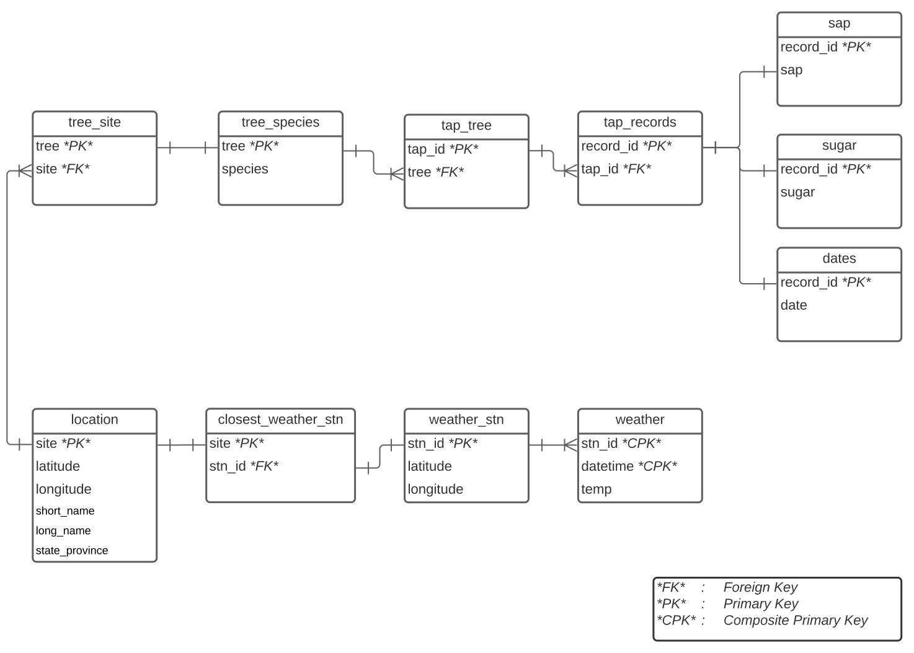

# About

It is widely accepted that maple syrup is the most delicious substance known to humanity ([Pentelow, 2021](https://github.com/spentelow/sapflow)). There is a large and growing body of research related to the biological, chemical, and climatic factors affecting the production of maple syrup. As more and more data are collected these areas, the application of data science techniques provides value in organizing and visualizing the data as well as in inference and prediction tasks. This repository draws together sap production data made available by @stinson, publicly available weather data from the US National Oceanic and Atmospheric Administration weather stations, and a prediction model proposed by @houle.

## Purpose

This repository has been created with three primary purposes:

1.  Apply the weekly sap prediction model proposed by @houle to data presented in @stinson to see if the model produced predictions of similar precision to that reported by @houle on the original data set.*Note that the model referred to here is a logistic regression model predicting 'yes' or 'no' in response the question 'will sap be produced?' in a given week.*
2.  Develop my own skill in working with diverse data sets, organizing data from multiple sources, and creating analysis pipelines.
3.  Create a model to predict the volume of sap produced in a given week the data from @stinson. *Note that this model would produce a numeric prediction in response to the question 'how much sap will be produced?' in a given week.*

Significant work has been completed to date related to the first two purposes and work related to the third is anticipated in the near future.

## Organization

This repository consists of:

1. Various scripts which download, clean, and analyze the data; and
1. An interactive coding notebook that walks through the most significant analysis.

The first item begins with downloading sap flow data provided for 6 measurement locations ('Sites') by @stinson from the USGS ScienceBase-Catelogue.  The data are then normalized into a series of smaller tables for ease-of-use.  Central to the overall analysis is pairing the sap flow data with local weather data.  To do so, a NOAA weather station nearby each data collection site has been manually identified.  Pairing these weather stations with the available period of measurements for the nearby Sites (extracted from the normalized sap flow data), historical weather data from the selected weather stations are downloaded for the appropriate periods.  Several derived parameters were generated from the raw sap and weather data are important to the remainder of the analysis: Growing Degree Days (GDD), Freeze-Thaw Cycles (frthw), weekly sap flow, and weekly sugar.

Using the tables described above, the prediction model proposed by @houle was tested on data from the Sites investigated by @stinson.  A [Jupyter Notebook](documentation/weekly_analysis.ipynb) was used to perform this analysis and include annotations on each of the key steps.

The flow chart below illustrates the pipeline comprising this analysis at a high level.

The following image illustrates the structure and connection between the various normalized sap flow and weather data tables.  Note that derived parameter tables are not included.

## References
